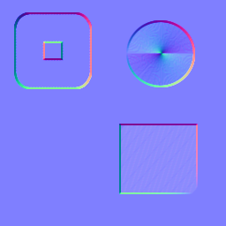
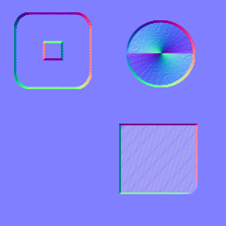
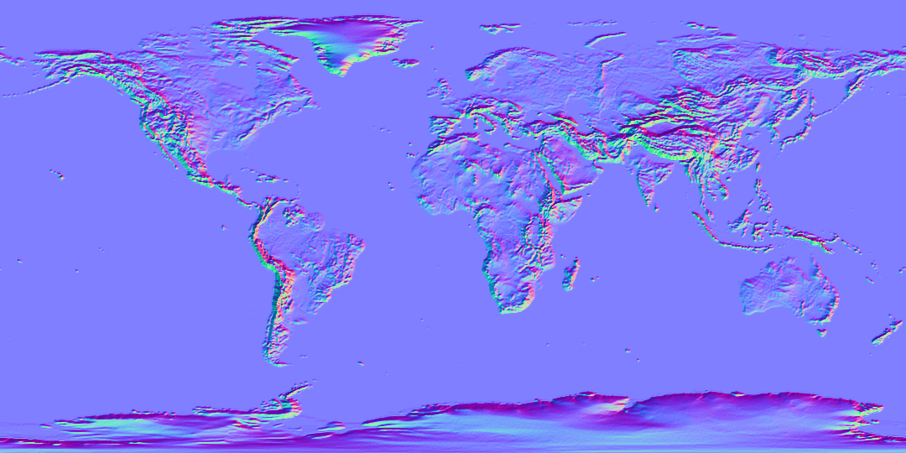

# Normal_Heights

Just a simple (rust) library to create a normal map from a height map.

Also includes a thin CLI wrapper.

## Example Library Usage

```rust
    let img = image::open(input)?;
    let dirextx = true;
    let normal_map = normal_heights::map_normals(&img, true);
    normal_map.save(output)?;
```

```rust
    let img = image::open(input)?;
    let strength = 3.14;
    let dirextx = false;
    let normal_map = normal_heights::map_normals_with_strength(&img, strength, directx);
    normal_map.save(output)?;
```

For a fully executable example, see src/main.rs.

## CLI Wrapper

### Help String

```
USAGE:
    normal-heights [OPTIONS] <INPUT> <OUTPUT>

FLAGS:
    -h, --help       Prints help information
    -V, --version    Prints version information

OPTIONS:
    -s, --strength <strength>
            Strength of the resulting normal map. [default: 6.0]
    -d, --directx <true | false>
            Generate DirextX normals (Inverted Y). [default: false]


ARGS:
    <INPUT>     Input height map image file.
    <OUTPUT>    Filename to write the normal map to.
```

### Example Usage

```sh
    normal-heights heightmap.png normalmap.png
```

## Supported Image Formats

See Image crate, [version 0.23.7](https://github.com/image-rs/image/tree/78568491ed6504c01cdbacbcfc87bd1c5d61fa52#21-supported-image-formats).

## Example Output

### Misc shapes:

Input:


Output (strength 3.14, directx false):


Output (strength 3.14, directx true):



Output (strength 8, directx false):


Output (strength 8, directx true):



### World:

Input:


Output (default strength 6, directx false):


Output (default strength 6, directx true):


